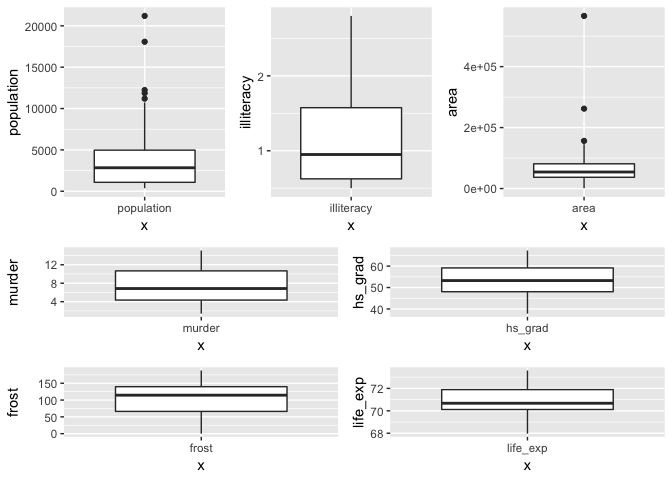
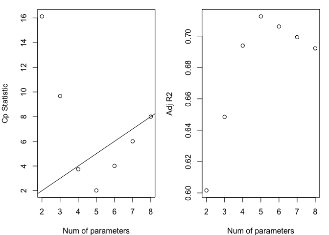
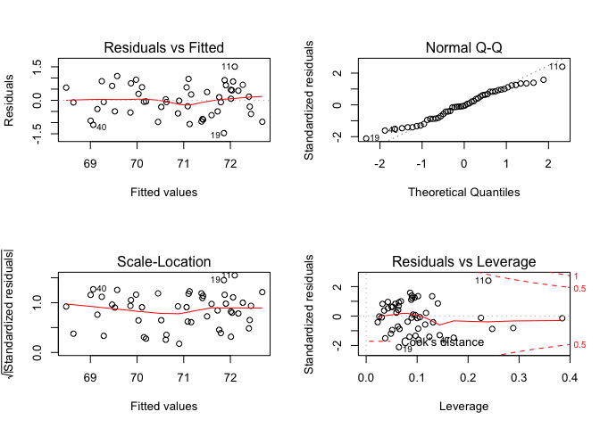

Homework 5
================
Xinyi Lin
11/24/2018

``` r
library(tidyverse)
```

    ## ── Attaching packages ──────────────────────────────────────────────────────────────────────── tidyverse 1.2.1 ──

    ## ✔ ggplot2 3.1.0     ✔ purrr   0.2.5
    ## ✔ tibble  1.4.2     ✔ dplyr   0.7.8
    ## ✔ tidyr   0.8.2     ✔ stringr 1.3.1
    ## ✔ readr   1.1.1     ✔ forcats 0.3.0

    ## ── Conflicts ─────────────────────────────────────────────────────────────────────────── tidyverse_conflicts() ──
    ## ✖ dplyr::filter() masks stats::filter()
    ## ✖ dplyr::lag()    masks stats::lag()

``` r
library(faraway)
library(leaps)
library(caret)
```

    ## Loading required package: lattice

    ## 
    ## Attaching package: 'lattice'

    ## The following object is masked from 'package:faraway':
    ## 
    ##     melanoma

    ## 
    ## Attaching package: 'caret'

    ## The following object is masked from 'package:purrr':
    ## 
    ##     lift

``` r
library(patchwork)
```

Input and tidy data
-------------------

``` r
data(state)
head(state.x77)
```

    ##            Population Income Illiteracy Life Exp Murder HS Grad Frost
    ## Alabama          3615   3624        2.1    69.05   15.1    41.3    20
    ## Alaska            365   6315        1.5    69.31   11.3    66.7   152
    ## Arizona          2212   4530        1.8    70.55    7.8    58.1    15
    ## Arkansas         2110   3378        1.9    70.66   10.1    39.9    65
    ## California      21198   5114        1.1    71.71   10.3    62.6    20
    ## Colorado         2541   4884        0.7    72.06    6.8    63.9   166
    ##              Area
    ## Alabama     50708
    ## Alaska     566432
    ## Arizona    113417
    ## Arkansas    51945
    ## California 156361
    ## Colorado   103766

``` r
state_clean_df =
  as.tibble(state.x77) %>% 
  janitor::clean_names()

state_clean_df 
```

    ## # A tibble: 50 x 8
    ##    population income illiteracy life_exp murder hs_grad frost   area
    ##         <dbl>  <dbl>      <dbl>    <dbl>  <dbl>   <dbl> <dbl>  <dbl>
    ##  1       3615   3624        2.1     69.0   15.1    41.3    20  50708
    ##  2        365   6315        1.5     69.3   11.3    66.7   152 566432
    ##  3       2212   4530        1.8     70.6    7.8    58.1    15 113417
    ##  4       2110   3378        1.9     70.7   10.1    39.9    65  51945
    ##  5      21198   5114        1.1     71.7   10.3    62.6    20 156361
    ##  6       2541   4884        0.7     72.1    6.8    63.9   166 103766
    ##  7       3100   5348        1.1     72.5    3.1    56     139   4862
    ##  8        579   4809        0.9     70.1    6.2    54.6   103   1982
    ##  9       8277   4815        1.3     70.7   10.7    52.6    11  54090
    ## 10       4931   4091        2       68.5   13.9    40.6    60  58073
    ## # ... with 40 more rows

Question 1
----------

``` r
summary(state_clean_df)
```

    ##    population        income       illiteracy       life_exp    
    ##  Min.   :  365   Min.   :3098   Min.   :0.500   Min.   :67.96  
    ##  1st Qu.: 1080   1st Qu.:3993   1st Qu.:0.625   1st Qu.:70.12  
    ##  Median : 2838   Median :4519   Median :0.950   Median :70.67  
    ##  Mean   : 4246   Mean   :4436   Mean   :1.170   Mean   :70.88  
    ##  3rd Qu.: 4968   3rd Qu.:4814   3rd Qu.:1.575   3rd Qu.:71.89  
    ##  Max.   :21198   Max.   :6315   Max.   :2.800   Max.   :73.60  
    ##      murder          hs_grad          frost             area       
    ##  Min.   : 1.400   Min.   :37.80   Min.   :  0.00   Min.   :  1049  
    ##  1st Qu.: 4.350   1st Qu.:48.05   1st Qu.: 66.25   1st Qu.: 36985  
    ##  Median : 6.850   Median :53.25   Median :114.50   Median : 54277  
    ##  Mean   : 7.378   Mean   :53.11   Mean   :104.46   Mean   : 70736  
    ##  3rd Qu.:10.675   3rd Qu.:59.15   3rd Qu.:139.75   3rd Qu.: 81162  
    ##  Max.   :15.100   Max.   :67.30   Max.   :188.00   Max.   :566432

``` r
population_boxplot = 
  state_clean_df %>% 
  ggplot(aes(x = "population", y = population)) +
  geom_boxplot()
```

``` r
illiteracy_boxplot = 
  state_clean_df %>% 
  ggplot(aes(x = "illiteracy", y = illiteracy)) +
  geom_boxplot()
```

``` r
life_exp_boxplot = 
  state_clean_df %>% 
  ggplot(aes(x = "life_exp", y = life_exp)) +
  geom_boxplot()
```

``` r
murder_boxplot = 
  state_clean_df %>% 
  ggplot(aes(x = "murder", y = murder)) +
  geom_boxplot()
```

``` r
hs_grad_boxplot = 
  state_clean_df %>% 
  ggplot(aes(x = "hs_grad", y = hs_grad)) +
  geom_boxplot()
```

``` r
frost_boxplot = 
  state_clean_df %>% 
  ggplot(aes(x = "frost", y = frost)) +
  geom_boxplot()
```

``` r
area_boxplot = 
  state_clean_df %>% 
  ggplot(aes(x = "area", y = area)) +
  geom_boxplot()

(population_boxplot + illiteracy_boxplot + area_boxplot)/(murder_boxplot + hs_grad_boxplot + frost_boxplot + life_exp_boxplot)
```



Question 2-a)
-------------

### Backward

``` r
all_fit = lm(life_exp ~ ., data = state_clean_df)
step(all_fit, direction='backward')
```

    ## Start:  AIC=-22.18
    ## life_exp ~ population + income + illiteracy + murder + hs_grad + 
    ##     frost + area
    ## 
    ##              Df Sum of Sq    RSS     AIC
    ## - area        1    0.0011 23.298 -24.182
    ## - income      1    0.0044 23.302 -24.175
    ## - illiteracy  1    0.0047 23.302 -24.174
    ## <none>                    23.297 -22.185
    ## - population  1    1.7472 25.044 -20.569
    ## - frost       1    1.8466 25.144 -20.371
    ## - hs_grad     1    2.4413 25.738 -19.202
    ## - murder      1   23.1411 46.438  10.305
    ## 
    ## Step:  AIC=-24.18
    ## life_exp ~ population + income + illiteracy + murder + hs_grad + 
    ##     frost
    ## 
    ##              Df Sum of Sq    RSS     AIC
    ## - illiteracy  1    0.0038 23.302 -26.174
    ## - income      1    0.0059 23.304 -26.170
    ## <none>                    23.298 -24.182
    ## - population  1    1.7599 25.058 -22.541
    ## - frost       1    2.0488 25.347 -21.968
    ## - hs_grad     1    2.9804 26.279 -20.163
    ## - murder      1   26.2721 49.570  11.569
    ## 
    ## Step:  AIC=-26.17
    ## life_exp ~ population + income + murder + hs_grad + frost
    ## 
    ##              Df Sum of Sq    RSS     AIC
    ## - income      1     0.006 23.308 -28.161
    ## <none>                    23.302 -26.174
    ## - population  1     1.887 25.189 -24.280
    ## - frost       1     3.037 26.339 -22.048
    ## - hs_grad     1     3.495 26.797 -21.187
    ## - murder      1    34.739 58.041  17.456
    ## 
    ## Step:  AIC=-28.16
    ## life_exp ~ population + murder + hs_grad + frost
    ## 
    ##              Df Sum of Sq    RSS     AIC
    ## <none>                    23.308 -28.161
    ## - population  1     2.064 25.372 -25.920
    ## - frost       1     3.122 26.430 -23.877
    ## - hs_grad     1     5.112 28.420 -20.246
    ## - murder      1    34.816 58.124  15.528

    ## 
    ## Call:
    ## lm(formula = life_exp ~ population + murder + hs_grad + frost, 
    ##     data = state_clean_df)
    ## 
    ## Coefficients:
    ## (Intercept)   population       murder      hs_grad        frost  
    ##   7.103e+01    5.014e-05   -3.001e-01    4.658e-02   -5.943e-03

### Forward

``` r
start_fit = lm(life_exp ~ 1, data = state_clean_df)
step(start_fit, direction = 'forward', scope = list(upper = all_fit, lower = start_fit))
```

    ## Start:  AIC=30.44
    ## life_exp ~ 1
    ## 
    ##              Df Sum of Sq    RSS     AIC
    ## + murder      1    53.838 34.461 -14.609
    ## + illiteracy  1    30.578 57.721  11.179
    ## + hs_grad     1    29.931 58.368  11.737
    ## + income      1    10.223 78.076  26.283
    ## + frost       1     6.064 82.235  28.878
    ## <none>                    88.299  30.435
    ## + area        1     1.017 87.282  31.856
    ## + population  1     0.409 87.890  32.203
    ## 
    ## Step:  AIC=-14.61
    ## life_exp ~ murder
    ## 
    ##              Df Sum of Sq    RSS     AIC
    ## + hs_grad     1    4.6910 29.770 -19.925
    ## + population  1    4.0161 30.445 -18.805
    ## + frost       1    3.1346 31.327 -17.378
    ## + income      1    2.4047 32.057 -16.226
    ## <none>                    34.461 -14.609
    ## + area        1    0.4697 33.992 -13.295
    ## + illiteracy  1    0.2732 34.188 -13.007
    ## 
    ## Step:  AIC=-19.93
    ## life_exp ~ murder + hs_grad
    ## 
    ##              Df Sum of Sq    RSS     AIC
    ## + frost       1    4.3987 25.372 -25.920
    ## + population  1    3.3405 26.430 -23.877
    ## <none>                    29.770 -19.925
    ## + illiteracy  1    0.4419 29.328 -18.673
    ## + area        1    0.2775 29.493 -18.394
    ## + income      1    0.1022 29.668 -18.097
    ## 
    ## Step:  AIC=-25.92
    ## life_exp ~ murder + hs_grad + frost
    ## 
    ##              Df Sum of Sq    RSS     AIC
    ## + population  1   2.06358 23.308 -28.161
    ## <none>                    25.372 -25.920
    ## + income      1   0.18232 25.189 -24.280
    ## + illiteracy  1   0.17184 25.200 -24.259
    ## + area        1   0.02573 25.346 -23.970
    ## 
    ## Step:  AIC=-28.16
    ## life_exp ~ murder + hs_grad + frost + population
    ## 
    ##              Df Sum of Sq    RSS     AIC
    ## <none>                    23.308 -28.161
    ## + income      1 0.0060582 23.302 -26.174
    ## + illiteracy  1 0.0039221 23.304 -26.170
    ## + area        1 0.0007900 23.307 -26.163

    ## 
    ## Call:
    ## lm(formula = life_exp ~ murder + hs_grad + frost + population, 
    ##     data = state_clean_df)
    ## 
    ## Coefficients:
    ## (Intercept)       murder      hs_grad        frost   population  
    ##   7.103e+01   -3.001e-01    4.658e-02   -5.943e-03    5.014e-05

### Stepwise

``` r
all_fit = lm(life_exp ~ ., data = state_clean_df)
step(all_fit, direction = 'both')
```

    ## Start:  AIC=-22.18
    ## life_exp ~ population + income + illiteracy + murder + hs_grad + 
    ##     frost + area
    ## 
    ##              Df Sum of Sq    RSS     AIC
    ## - area        1    0.0011 23.298 -24.182
    ## - income      1    0.0044 23.302 -24.175
    ## - illiteracy  1    0.0047 23.302 -24.174
    ## <none>                    23.297 -22.185
    ## - population  1    1.7472 25.044 -20.569
    ## - frost       1    1.8466 25.144 -20.371
    ## - hs_grad     1    2.4413 25.738 -19.202
    ## - murder      1   23.1411 46.438  10.305
    ## 
    ## Step:  AIC=-24.18
    ## life_exp ~ population + income + illiteracy + murder + hs_grad + 
    ##     frost
    ## 
    ##              Df Sum of Sq    RSS     AIC
    ## - illiteracy  1    0.0038 23.302 -26.174
    ## - income      1    0.0059 23.304 -26.170
    ## <none>                    23.298 -24.182
    ## - population  1    1.7599 25.058 -22.541
    ## + area        1    0.0011 23.297 -22.185
    ## - frost       1    2.0488 25.347 -21.968
    ## - hs_grad     1    2.9804 26.279 -20.163
    ## - murder      1   26.2721 49.570  11.569
    ## 
    ## Step:  AIC=-26.17
    ## life_exp ~ population + income + murder + hs_grad + frost
    ## 
    ##              Df Sum of Sq    RSS     AIC
    ## - income      1     0.006 23.308 -28.161
    ## <none>                    23.302 -26.174
    ## - population  1     1.887 25.189 -24.280
    ## + illiteracy  1     0.004 23.298 -24.182
    ## + area        1     0.000 23.302 -24.174
    ## - frost       1     3.037 26.339 -22.048
    ## - hs_grad     1     3.495 26.797 -21.187
    ## - murder      1    34.739 58.041  17.456
    ## 
    ## Step:  AIC=-28.16
    ## life_exp ~ population + murder + hs_grad + frost
    ## 
    ##              Df Sum of Sq    RSS     AIC
    ## <none>                    23.308 -28.161
    ## + income      1     0.006 23.302 -26.174
    ## + illiteracy  1     0.004 23.304 -26.170
    ## + area        1     0.001 23.307 -26.163
    ## - population  1     2.064 25.372 -25.920
    ## - frost       1     3.122 26.430 -23.877
    ## - hs_grad     1     5.112 28.420 -20.246
    ## - murder      1    34.816 58.124  15.528

    ## 
    ## Call:
    ## lm(formula = life_exp ~ population + murder + hs_grad + frost, 
    ##     data = state_clean_df)
    ## 
    ## Coefficients:
    ## (Intercept)   population       murder      hs_grad        frost  
    ##   7.103e+01    5.014e-05   -3.001e-01    4.658e-02   -5.943e-03

According to the results, when using three methods, we get same 'best subset' which 'population, murder, hs\_grad and frost'.

Question 2-b)
-------------

``` r
fitted_model = lm(formula = life_exp ~ population + murder + hs_grad + frost, 
    data = state_clean_df)

summary(fitted_model)
```

    ## 
    ## Call:
    ## lm(formula = life_exp ~ population + murder + hs_grad + frost, 
    ##     data = state_clean_df)
    ## 
    ## Residuals:
    ##      Min       1Q   Median       3Q      Max 
    ## -1.47095 -0.53464 -0.03701  0.57621  1.50683 
    ## 
    ## Coefficients:
    ##               Estimate Std. Error t value Pr(>|t|)    
    ## (Intercept)  7.103e+01  9.529e-01  74.542  < 2e-16 ***
    ## population   5.014e-05  2.512e-05   1.996  0.05201 .  
    ## murder      -3.001e-01  3.661e-02  -8.199 1.77e-10 ***
    ## hs_grad      4.658e-02  1.483e-02   3.142  0.00297 ** 
    ## frost       -5.943e-03  2.421e-03  -2.455  0.01802 *  
    ## ---
    ## Signif. codes:  0 '***' 0.001 '**' 0.01 '*' 0.05 '.' 0.1 ' ' 1
    ## 
    ## Residual standard error: 0.7197 on 45 degrees of freedom
    ## Multiple R-squared:  0.736,  Adjusted R-squared:  0.7126 
    ## F-statistic: 31.37 on 4 and 45 DF,  p-value: 1.696e-12

``` r
cor(state_clean_df)
```

    ##             population     income  illiteracy    life_exp     murder
    ## population  1.00000000  0.2082276  0.10762237 -0.06805195  0.3436428
    ## income      0.20822756  1.0000000 -0.43707519  0.34025534 -0.2300776
    ## illiteracy  0.10762237 -0.4370752  1.00000000 -0.58847793  0.7029752
    ## life_exp   -0.06805195  0.3402553 -0.58847793  1.00000000 -0.7808458
    ## murder      0.34364275 -0.2300776  0.70297520 -0.78084575  1.0000000
    ## hs_grad    -0.09848975  0.6199323 -0.65718861  0.58221620 -0.4879710
    ## frost      -0.33215245  0.2262822 -0.67194697  0.26206801 -0.5388834
    ## area        0.02254384  0.3633154  0.07726113 -0.10733194  0.2283902
    ##                hs_grad      frost        area
    ## population -0.09848975 -0.3321525  0.02254384
    ## income      0.61993232  0.2262822  0.36331544
    ## illiteracy -0.65718861 -0.6719470  0.07726113
    ## life_exp    0.58221620  0.2620680 -0.10733194
    ## murder     -0.48797102 -0.5388834  0.22839021
    ## hs_grad     1.00000000  0.3667797  0.33354187
    ## frost       0.36677970  1.0000000  0.05922910
    ## area        0.33354187  0.0592291  1.00000000

According to the summary results, we can find the p-value of `population` variable is slightly bigger than 0.05 which is a close call, so we try to compare models with and without `population` variable.

``` r
fitted_less_model = lm(formula = life_exp ~ murder + hs_grad + frost, 
    data = state_clean_df)

summary(fitted_less_model)
```

    ## 
    ## Call:
    ## lm(formula = life_exp ~ murder + hs_grad + frost, data = state_clean_df)
    ## 
    ## Residuals:
    ##     Min      1Q  Median      3Q     Max 
    ## -1.5015 -0.5391  0.1014  0.5921  1.2268 
    ## 
    ## Coefficients:
    ##              Estimate Std. Error t value Pr(>|t|)    
    ## (Intercept) 71.036379   0.983262  72.246  < 2e-16 ***
    ## murder      -0.283065   0.036731  -7.706 8.04e-10 ***
    ## hs_grad      0.049949   0.015201   3.286  0.00195 ** 
    ## frost       -0.006912   0.002447  -2.824  0.00699 ** 
    ## ---
    ## Signif. codes:  0 '***' 0.001 '**' 0.01 '*' 0.05 '.' 0.1 ' ' 1
    ## 
    ## Residual standard error: 0.7427 on 46 degrees of freedom
    ## Multiple R-squared:  0.7127, Adjusted R-squared:  0.6939 
    ## F-statistic: 38.03 on 3 and 46 DF,  p-value: 1.634e-12

``` r
anova(fitted_model, fitted_less_model)
```

    ## Analysis of Variance Table
    ## 
    ## Model 1: life_exp ~ population + murder + hs_grad + frost
    ## Model 2: life_exp ~ murder + hs_grad + frost
    ##   Res.Df    RSS Df Sum of Sq      F  Pr(>F)  
    ## 1     45 23.308                              
    ## 2     46 25.372 -1   -2.0636 3.9841 0.05201 .
    ## ---
    ## Signif. codes:  0 '***' 0.001 '**' 0.01 '*' 0.05 '.' 0.1 ' ' 1

The adjuested r-square of the model without 'population' is slightly less than the adjuested r-square of the model with 'population' and AIC of the model with 'population' also perform better, so keeping the `population` variable is a better choice.

Question 2-c)
-------------

``` r
add_illiteracy_model = lm(formula = life_exp ~ murder + hs_grad + frost + illiteracy, 
    data = state_clean_df)

summary(add_illiteracy_model)
```

    ## 
    ## Call:
    ## lm(formula = life_exp ~ murder + hs_grad + frost + illiteracy, 
    ##     data = state_clean_df)
    ## 
    ## Residuals:
    ##      Min       1Q   Median       3Q      Max 
    ## -1.48906 -0.51040  0.09793  0.55193  1.33480 
    ## 
    ## Coefficients:
    ##              Estimate Std. Error t value Pr(>|t|)    
    ## (Intercept) 71.519958   1.320487  54.162  < 2e-16 ***
    ## murder      -0.273118   0.041138  -6.639  3.5e-08 ***
    ## hs_grad      0.044970   0.017759   2.532  0.01490 *  
    ## frost       -0.007678   0.002828  -2.715  0.00936 ** 
    ## illiteracy  -0.181608   0.327846  -0.554  0.58236    
    ## ---
    ## Signif. codes:  0 '***' 0.001 '**' 0.01 '*' 0.05 '.' 0.1 ' ' 1
    ## 
    ## Residual standard error: 0.7483 on 45 degrees of freedom
    ## Multiple R-squared:  0.7146, Adjusted R-squared:  0.6892 
    ## F-statistic: 28.17 on 4 and 45 DF,  p-value: 9.547e-12

``` r
cor(state_clean_df)
```

    ##             population     income  illiteracy    life_exp     murder
    ## population  1.00000000  0.2082276  0.10762237 -0.06805195  0.3436428
    ## income      0.20822756  1.0000000 -0.43707519  0.34025534 -0.2300776
    ## illiteracy  0.10762237 -0.4370752  1.00000000 -0.58847793  0.7029752
    ## life_exp   -0.06805195  0.3402553 -0.58847793  1.00000000 -0.7808458
    ## murder      0.34364275 -0.2300776  0.70297520 -0.78084575  1.0000000
    ## hs_grad    -0.09848975  0.6199323 -0.65718861  0.58221620 -0.4879710
    ## frost      -0.33215245  0.2262822 -0.67194697  0.26206801 -0.5388834
    ## area        0.02254384  0.3633154  0.07726113 -0.10733194  0.2283902
    ##                hs_grad      frost        area
    ## population -0.09848975 -0.3321525  0.02254384
    ## income      0.61993232  0.2262822  0.36331544
    ## illiteracy -0.65718861 -0.6719470  0.07726113
    ## life_exp    0.58221620  0.2620680 -0.10733194
    ## murder     -0.48797102 -0.5388834  0.22839021
    ## hs_grad     1.00000000  0.3667797  0.33354187
    ## frost       0.36677970  1.0000000  0.05922910
    ## area        0.33354187  0.0592291  1.00000000

The correlation of `hs_grad` and `illiteracy` is -0.657 and when adding `illiteracy` in model, the coefficient of `hs_grad` change slightly, thus there are low association between `hs_grad` and `illiteracy` and my subset only contain `hs_grad`.

Question 3
----------

``` r
state_criterion_df =
  state_clean_df %>% 
  as.data.frame() %>% 
  select(life_exp, everything())

# Printing the best models of each size, using the Cp criterion:
leaps(x = state_criterion_df[,2:8], y = state_criterion_df[,1], nbest = 1, method = "Cp")
```

    ## $which
    ##       1     2     3    4     5     6     7
    ## 1 FALSE FALSE FALSE TRUE FALSE FALSE FALSE
    ## 2 FALSE FALSE FALSE TRUE  TRUE FALSE FALSE
    ## 3 FALSE FALSE FALSE TRUE  TRUE  TRUE FALSE
    ## 4  TRUE FALSE FALSE TRUE  TRUE  TRUE FALSE
    ## 5  TRUE  TRUE FALSE TRUE  TRUE  TRUE FALSE
    ## 6  TRUE  TRUE  TRUE TRUE  TRUE  TRUE FALSE
    ## 7  TRUE  TRUE  TRUE TRUE  TRUE  TRUE  TRUE
    ## 
    ## $label
    ## [1] "(Intercept)" "1"           "2"           "3"           "4"          
    ## [6] "5"           "6"           "7"          
    ## 
    ## $size
    ## [1] 2 3 4 5 6 7 8
    ## 
    ## $Cp
    ## [1] 16.126760  9.669894  3.739878  2.019659  4.008737  6.001959  8.000000

``` r
# Printing the best models of each size, using the adjusted R^2 criterion:
leaps(x = state_criterion_df[,2:8], y = state_criterion_df[,1], nbest = 1, method = "adjr2")
```

    ## $which
    ##       1     2     3    4     5     6     7
    ## 1 FALSE FALSE FALSE TRUE FALSE FALSE FALSE
    ## 2 FALSE FALSE FALSE TRUE  TRUE FALSE FALSE
    ## 3 FALSE FALSE FALSE TRUE  TRUE  TRUE FALSE
    ## 4  TRUE FALSE FALSE TRUE  TRUE  TRUE FALSE
    ## 5  TRUE  TRUE FALSE TRUE  TRUE  TRUE FALSE
    ## 6  TRUE  TRUE  TRUE TRUE  TRUE  TRUE FALSE
    ## 7  TRUE  TRUE  TRUE TRUE  TRUE  TRUE  TRUE
    ## 
    ## $label
    ## [1] "(Intercept)" "1"           "2"           "3"           "4"          
    ## [6] "5"           "6"           "7"          
    ## 
    ## $size
    ## [1] 2 3 4 5 6 7 8
    ## 
    ## $adjr2
    ## [1] 0.6015893 0.6484991 0.6939230 0.7125690 0.7061129 0.6993268 0.6921823

``` r
# Summary of models for each size (one model per size)
b = regsubsets(life_exp ~ ., data = state_criterion_df)
   (rs = summary(b))
```

    ## Subset selection object
    ## Call: regsubsets.formula(life_exp ~ ., data = state_criterion_df)
    ## 7 Variables  (and intercept)
    ##            Forced in Forced out
    ## population     FALSE      FALSE
    ## income         FALSE      FALSE
    ## illiteracy     FALSE      FALSE
    ## murder         FALSE      FALSE
    ## hs_grad        FALSE      FALSE
    ## frost          FALSE      FALSE
    ## area           FALSE      FALSE
    ## 1 subsets of each size up to 7
    ## Selection Algorithm: exhaustive
    ##          population income illiteracy murder hs_grad frost area
    ## 1  ( 1 ) " "        " "    " "        "*"    " "     " "   " " 
    ## 2  ( 1 ) " "        " "    " "        "*"    "*"     " "   " " 
    ## 3  ( 1 ) " "        " "    " "        "*"    "*"     "*"   " " 
    ## 4  ( 1 ) "*"        " "    " "        "*"    "*"     "*"   " " 
    ## 5  ( 1 ) "*"        "*"    " "        "*"    "*"     "*"   " " 
    ## 6  ( 1 ) "*"        "*"    "*"        "*"    "*"     "*"   " " 
    ## 7  ( 1 ) "*"        "*"    "*"        "*"    "*"     "*"   "*"

``` r
# Plots of Cp and Adj-R2 as functions of parameters
par(mar = c(4,4,1,1))
par(mfrow = c(1,2))

plot(2:(length(rs$cp) + 1), rs$cp, xlab = "Num of parameters", ylab = "Cp Statistic")
abline(0,1)

plot(2:(length(rs$cp) + 1), rs$adjr2, xlab = "Num of parameters", ylab = "Adj R2")
```



According to the Cp and adjusted r-square results, number of parameters are 4 to 8 are better models, so we count AIC and BIC of these models.

``` r
# AIC of the 3-predictor model:
fitted_4_model <- lm(life_exp ~ murder + hs_grad + frost, data = state_criterion_df)
AIC(fitted_4_model)
```

    ## [1] 117.9743

``` r
# BIC
AIC(fitted_4_model, k = log(length(state_criterion_df$life_exp)))
```

    ## [1] 127.5344

``` r
# AIC of the 4-predictor model:
fitted_5_model <- lm(life_exp ~ murder + hs_grad + frost + population, data = state_criterion_df)
AIC(fitted_5_model)
```

    ## [1] 115.7326

``` r
# BIC
AIC(fitted_5_model, k = log(length(state_criterion_df$life_exp)))
```

    ## [1] 127.2048

``` r
# AIC of the 5-predictor model:
fitted_6_model <- lm(life_exp ~ murder + hs_grad + frost + population + income, data = state_criterion_df)
AIC(fitted_6_model)
```

    ## [1] 117.7196

``` r
# BIC
AIC(fitted_6_model, k = log(length(state_criterion_df$life_exp)))
```

    ## [1] 131.1038

``` r
# AIC of the 6-predictor model:
fitted_7_model <- lm(life_exp ~ murder + hs_grad + frost + population + income + illiteracy, data = state_criterion_df)
AIC(fitted_7_model)
```

    ## [1] 119.7116

``` r
# BIC
AIC(fitted_7_model, k = log(length(state_criterion_df$life_exp)))
```

    ## [1] 135.0077

``` r
# AIC of the 7-predictor model:
fitted_8_model <- lm(life_exp ~ murder + hs_grad + frost + population + income + illiteracy + area, data = state_criterion_df)
AIC(fitted_8_model)
```

    ## [1] 121.7092

``` r
# BIC
AIC(fitted_8_model, k = log(length(state_criterion_df$life_exp)))
```

    ## [1] 138.9174

| models               | model 1 | model 2 | model 3 | model 4 | model 5 |
|----------------------|---------|---------|---------|---------|---------|
| number of parameters | p = 4   | p = 5   | p = 6   | p = 7   | p = 8   |
| Cp                   | 3.7399  | 2.0197  | 4.0087  | 6.0020  | 8.0000  |
| adjusted r-square    | 0.6939  | 0.7126  | 0.7061  | 0.6993  | 0.6922  |
| AIC                  | 117.974 | 115.733 | 117.720 | 119.712 | 121.709 |
| BIC                  | 127.534 | 127.205 | 131.104 | 135.008 | 138.917 |

Since model with 5 parameters has highest adjusted r-square, lowest AIC and BIC and its Cp lower than p, so 'best subset' is 'pulation, murder, hs\_grad and frost'.

Question 4
----------

Since the model selected from part 2 and part 3 is the same which is `lm(life_exp ~ murder + hs_grad + frost + population, data = state_criterion_df)`, so the final model is `lm(life_exp ~ murder + hs_grad + frost + population, data = state_criterion_df)`.

``` r
par(mfrow = c(2,2))
plot(fitted_5_model)
```



### leverage

According to the "Residuals vs Leverage" plot, there are no leverage in this data.

### model Assumptions

According to the 'Residuals vs Fitted' plot and 'Scale-Location\` plot, we can find that residuals are randomly spread along the change of fitted values and red lines are almost striaight and horizontal, which means the residuals are almost constant across the range of Xs. However, read lines are slightly curve around 71, which means the reiduals around 71 might be slightly lower.

For 'Normal Q-Q plot', we can see all dots except first and last few dots spread around the line, considering there are only 50 observations, this is a small sample. This outliers are normal and overall, residuals are normally distributed.

Question 5
----------

### 10-fold cross-validation

``` r
train_data = trainControl(method = "cv", number = 10)

# Fit the 4-variables model that we discussed in previous lectures
model_caret = 
  train(life_exp ~ murder + hs_grad + frost + population,
                   data = state_clean_df,
                   trControl = train_data,
                   method = 'lm',
                   na.action = na.pass)

model_caret
```

    ## Linear Regression 
    ## 
    ## 50 samples
    ##  4 predictor
    ## 
    ## No pre-processing
    ## Resampling: Cross-Validated (10 fold) 
    ## Summary of sample sizes: 46, 44, 46, 45, 44, 45, ... 
    ## Resampling results:
    ## 
    ##   RMSE       Rsquared   MAE      
    ##   0.7643322  0.7389997  0.6465613
    ## 
    ## Tuning parameter 'intercept' was held constant at a value of TRUE

Model coefficients

``` r
model_caret$finalModel
```

    ## 
    ## Call:
    ## lm(formula = .outcome ~ ., data = dat)
    ## 
    ## Coefficients:
    ## (Intercept)       murder      hs_grad        frost   population  
    ##   7.103e+01   -3.001e-01    4.658e-02   -5.943e-03    5.014e-05

Results of each fold

``` r
model_caret$resample
```

    ##         RMSE  Rsquared       MAE Resample
    ## 1  1.0529624 0.6488865 0.7303670   Fold01
    ## 2  0.6637024 0.8561644 0.5962412   Fold02
    ## 3  0.9693550 0.9196415 0.8417161   Fold03
    ## 4  1.0830380 0.1595651 1.0167564   Fold04
    ## 5  0.6422060 0.8016910 0.5410999   Fold05
    ## 6  0.5119089 0.8886039 0.3959724   Fold06
    ## 7  0.8808298 0.3408490 0.8059004   Fold07
    ## 8  0.7036066 0.8412051 0.6438501   Fold08
    ## 9  0.5138948 0.9892952 0.3660046   Fold09
    ## 10 0.6218181 0.9440959 0.5277051   Fold10

### residual sampling
